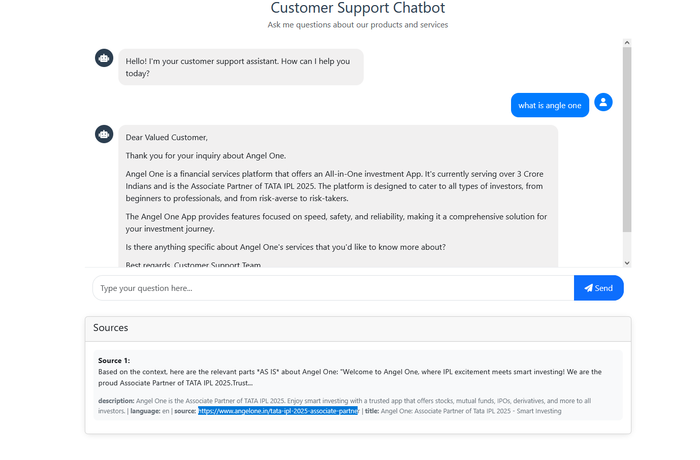

# Customer Support RAG Chatbot

A Retrieval-Augmented Generation (RAG) chatbot built to assist users with customer support queries. This chatbot only answers questions based on provided knowledge base documents, responding with "I don't know" when a question is outside its scope as stated.

## Features

- 📚 **Document Ingestion**: Processes various document formats (PDF, TXT, Markdown)
- 🔍 **Semantic Search**: Uses embeddings to find relevant information
- 💬 **Contextual Responses**: Generates answers based on retrieved context
- 🛑 **Knowledge Boundaries**: Responds with "I don't know" for questions outside its knowledge base
- 🖥️ **User-friendly Interface**: Clean, responsive web interface for interactions

## Live Demo

Access the live demo here: [RAG Chatbot Demo]()

## Technologies Used

- **Backend**: Flask
- **Vector Database**: FAISS
- **Embeddings**: Sentence Transformers
- **LLM for Generation**: Anthropic Claude
- **Frontend**: HTML, CSS, JavaScript



## Getting Started

### Prerequisites

- Python 3.8+
- Anthropic API Key

### Installation

1. Clone the repository:
   ```bash
   git clone https://github.com/bhavasagar/rag_chatbot.git
   cd rag_chatbot
   ```

2. Create and activate a virtual environment:
   ```bash
   python -m venv venv
   source venv/bin/activate
   ```

3. Install dependencies:
   ```bash
   pip install -r requirements.txt
   ```

4. Set up your Antropic API key:
   ```bash
   export LLM_API_KEY=your_api_key_here
   ```


### Adding Support Documents

Place your customer support documentation in the `data/documents` directory. The system supports:
- PDF files (`.pdf`)
- Text files (`.txt`)
- Markdown files (`.md`)

### Building the Document Index

After adding documents, build the vector index:
```bash
python -m rag.document_loader
```

### Running the Application

Start the Flask server:
```bash
python app.py
```

Then visit `http://localhost:5000` in your browser.


## Project Structure

```
rag-chatbot/
├── app.py
├── static/
│   ├── css/
│   │   └── style.css
│   └── js/
│       └── script.js
├── templates/
│   └── index.html
├── rag/
│   ├── __init__.py
│   ├── document_loader.py
│   ├── embeddings.py
│   ├── vector_store.py
│   └── retriever.py
├── data/
├── requirements.txt
└── README.md
```

## API Documentation

### `/api/chat` (POST)

Endpoint for chat interactions.

**Request Body:**
```json
{
  "question": "What is angel one?"
}
```

**Response:**
```json
{
  "answer": "Angel One is a financial services platform that offers an All-in-One investment App. It's currently serving over 3 Crore Indians and is the Associate Partner of TATA IPL 2025. The platform is designed to cater to all types of investors, from beginners to professionals, and from risk-averse to risk-takers.

The Angel One App provides features focused on speed, safety, and reliability, making it a comprehensive solution for your investment journey.",
  "sources": [
    {
      "content": "Based on the context, here are the relevant parts *AS IS* about Angel One: Welcome to Angel One, where IPL excitement meets smart investing! We are the Associate Partner of TATA IPL 2025.Trust...",
      "metadata": {
        "source": "https://www.angelone.in/support",
      }
    }
  ]
}
```

## Contact

bhavasagar09@gmail.com


## Pending Actions
- [ ] Add docstrings/comments in files other than `document_loader.py`
- [ ] Update to cloud vector db (pinecone, looking for other alternatives as of now.)
- [ ] Improve the prompt used in `retriever.py`
- [ ] Add persistent storage db (mssql/postgress)